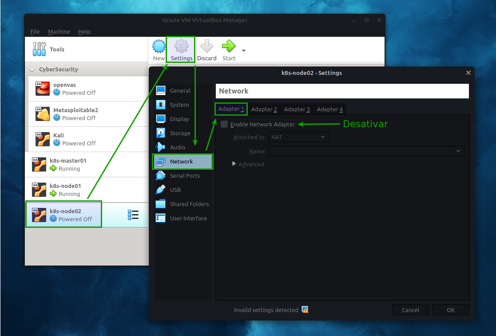

# Repositório destinado ao deploy do Kubernetes

## Introdução
Devido alta procura da solução de Kubernetes pelo mercado tecnológico, resolvi criar este playbook para ajudar as pessoas que querem conhecer mais de perto esta solução.
Este playbook [Ansible](https://www.ansible.com) foi desenvolvido para subir um cluster de Kubernetes utilizando [Vagrant](https://www.vagrantup.com) e [Virtualbox](https://www.virtualbox.org). O sistema operacional utilizado para isso foi o [Linux Mint](https://linuxmint.com) 20 Ulyana.

As versões das soluções utilizadas foram:

- Ansible: 2.9.12
- Vagrant: 2.2.6
- Virtualbox: 6.1.10

## Requisitos
Para uma boa experiência de utilização do Kubernetes é altamente recomendado que o seu computador/notebook tenha aos menos os recursos abaixo:

- Memória: 16GB
- CPU: 8 vcpus
- Disk: 100G

Também será necessário criar uma chave SSH para que o acesso aos servidores seja possível, tanto pelo playbook quando via terminal. Caso você já tenha as chaves privada e pública garanta apenas que os nomes das mesmas sejam "id_rsa" e "id_rsa.pub".
Caso você não tenha nenhuma chave configurada no seu computador/notebook, utilize o comando abaixo para gerar uma nova:

```
ssh-keygen -t rsa -b 4096
```

Obs.: Apenas digite enter nas perguntas que forem apresentadas. Valide as permissões das chaves criadas, mantendo as mesmas apenas com permissão de leitura.

Com a chave privada gerada copie o conteúdo da mesma e adicione no arquivo presente no diretório "ssh_key" com o nome de "id_rsa".
Ajuste a permissão da chave com o comando abaixo:

```
chmod 0400 id_rsa
```

## Observações Importantes
Antes de executar o playbook efetue os ajustes necessários nas variáveis presentes no diretório "defaults" dentro de cada playbook (diretório "roles"), adicionando suas informações de rede, nome de usuário, nome do grupo e o nome do diretório HOME do usuário que será utilizado. 
Os arquivos do Vagrant estão configurados para receber interfaces do tipo "bridge". Verifique qual é o nome da sua interface de rede física (exemplos: eth0, enps2, eno1, etc) para utilizá-la.

Você pode verificar o nome de sua interface de rede executando os comandos abaixo:

```
sudo ip a s
```

ou

```
sudo ifconfig
```

Uma vez que todas as ferramentas forem instaladas e as configurações ajustadas você estará pronto para executar o playbook.


## Criando servidores
Para instalar e configurar os servidores utilize o comando abaixo:

```
ansible-playbook -i inventory/localhost playbooks/vagrant.yaml -vvv
```

Ao final da execução do playbook os servidores serão desligados automaticamente. Será necessário ajustar as configurações de rede no Virtualbox, desativando a interface tipo NAT. Segue um exemplo abaixo:



Aplique este procedimento em todos os servidores e em seguida inicie todos novamente. Aguarde alguns segundos para que todos estejam na tela de login. 

Para acessar os servidores via SSH utilize o comando abaixo:

```
ssh -l vagrant <IP_SERVIDOR>
```

## Configurando o servidor Master
Para instalar e configurar o servidor Master utiliza o comando abaixo:

```
ansible-playbook -i inventory/k8s_inventory playbooks/masters.yaml -vvv
```

Quando o playbook for finalizado com sucesso, será apresentado algumas informações relacionadas ao kubeadm. Copie o resultado que será similar ao exemplo abaixo:

*kubeadm join 192.168.1.10:6443 --token hong2x.o1cox86w0dim4ujr --discovery-token-ca-cert-hash sha256:0e9d31434a5afcceb1b171ea0e5f165d482aea63111746682d56f012ef09532d*

Este comando será utilizado para adicionar os nós no cluster de Kubernetes.

## Configurando os servidores Nós
Para instalar e configurar os servidores nós utilize o comando abaixo:

```
ansible-playbook -i inventory/k8s_inventory playbooks/nodes.yaml -vvv
```

Ao término da execução do playbook, acesse os servidores nós e execute o comando do "kubeadm join" utilizando o "sudo". Segue exemplo abaixo:

```
sudo kubeadm join 192.168.1.10:6443 --token hong2x.o1cox86w0dim4ujr --discovery-token-ca-cert-hash sha256:0e9d31434a5afcceb1b171ea0e5f165d482aea63111746682d56f012ef09532d
```

## Validando o Cluster de Kubernetes
Com tudo instalado e configurado, acess o servidor Master e execute o comando abaixo para validar o funcionamento do Cluster:

```
kubectl get nodes -o wide
```
O resultado será algo similar ao apresentado abaixo:


### Pronto! Você está pronto para utilizar o seu cluster de Kubernetes!
